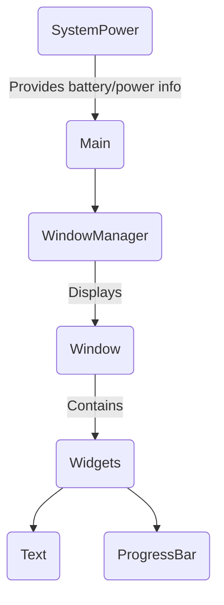

# StickOS

## Overview

Operating system *-ish* for the M5 Stick C Plus

## Stuff you'll need

### Hardware

- The M5Stick-C Plus
- A USB-C cable to upload your files

### Software

The project uses some librairies in order to control the material (M5Unified) and the graphics (M5GFX)

- [M5Unified repo](https://github.com/m5stack/M5Unified)
- [M5GFX repo](https://github.com/m5stack/M5GFX)

## Installation

*Coming soon*

## Project structure

### Filesystem

The project currently has the following structure:

```bash
.
├── include             # classes declaration
│   ├── SystemPower.h
│   ├── Text.h
│   ├── Widget.h
│   └── Window.h
├── lib                 # librairies
├── LICENSE
├── platformio.ini
├── README.md
├── src                 # source code
│   ├── main.cpp
│   ├── SystemPower.cpp
│   ├── Text.cpp
│   └── Widget.cpp
└── test                # testing
```

### Polymorphism



## Changelog

Here is the history of the versions and the stuff that has been modified:

**v0.0.5**
- README has been updated in order to be more explicit about polymorphism and the classes used.
- Minor changes.

**v0.0.4**
- Added the abstract class `Widget` as a parent class for all the widgets.
- Added a `Text` class that manages the text items.
- A `Window` class is being written to handle the windows and their widgets.

**v0.0.3**
- Fixed an issue in `SystemPower` to avoid turning off on unplug.
  Lowered the voltage limit to 3.3v.

**v0.0.2**
- `SystemPower` has been updated.
  The device now enters in light sleep mode after a short delay if no buttons are pressed to reduce battery usage.

**v0.0.1**
- `SystemPower` module has been added.
  The StickC now turns off when its battery reaches 3.5v to protect it.
  Charging current has been limited to 100mAh to reduce heating and preserve battery health.
  The integrated LED (GPIO10) now turns on when the device is on and charging.
